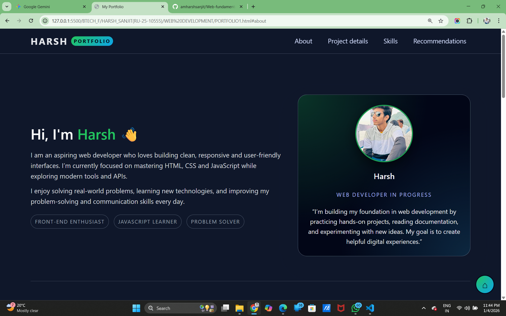
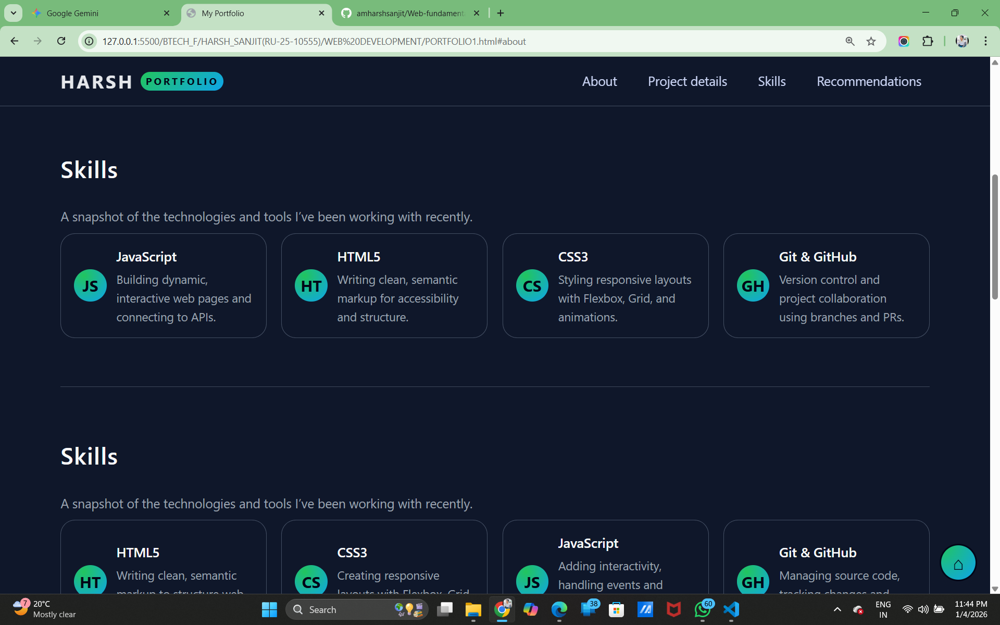
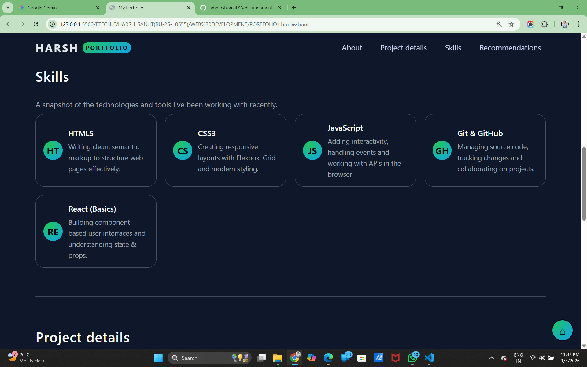
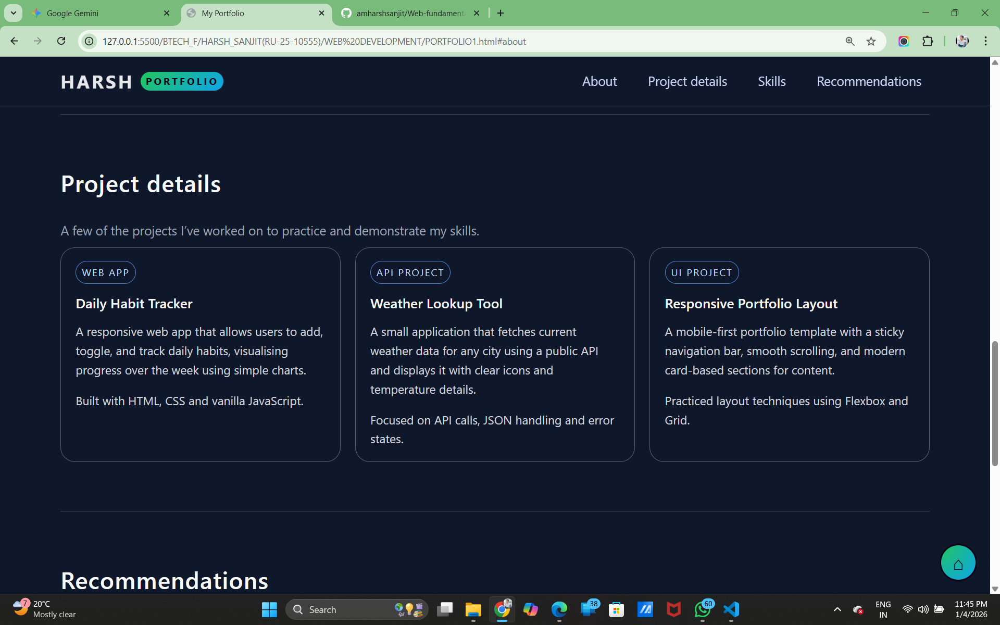

# Web-fundamentals-Mini-Project
This is college related Mini project.
# 🌐 [Harsh sanjit] | Frontend Developer

### ⚡ "Bringing ideas to life with code and creativity."

---

### 👨‍💻 About Me
I am a Frontend Developer dedicated to building responsive, interactive, and user-friendly web applications using **HTML5, CSS3, and JavaScript**. I enjoy turning complex designs into pixel-perfect reality.

- 🎨 **Focus:** Responsive Web Design & UI/UX
- 🚀 **Currently Learning:** Advanced JavaScript patterns and CSS Animations
- 🛠️ **Approach:** Clean, semantic code and mobile-first design

---

### 🛠 Tech Stack

**Languages & Core Tech:**

---

### 📂 Featured Projects

#### 📱 [Responsive Personal Portfolio Website ]
*A fully responsive landing page with custom CSS animations and interactive JS elements.*
- **Key Features:** mobile menu, scroll-reveal effects.

---
## 📸 Output Screenshot

